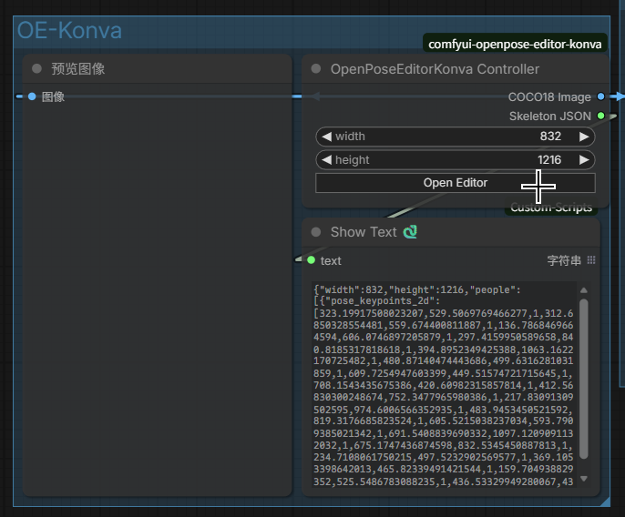
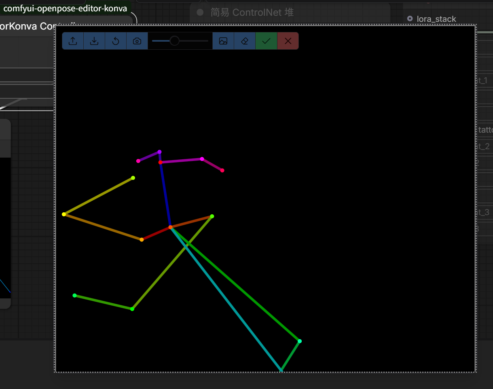

# ComfyUI-Openpose-Editor-Konva

## 概述 - Overview

### 怎么用？- How to use this node?

1. 搜索`OpenPoseEditorKonva Controller`节点，并将其添加到您的工作流。Search for `OpenPoseEditorKonva Controller` node, and add it to your workflow.
2. 点击节点上的`Open Editor`按钮。Click the `Open Editor` button on the node.

   

3. 编辑器将会出现，您可拖动关节点调整骨骼姿势。鼠标滚轮可缩放画面，鼠标中键拖动可拖动画布。The editor would appear, and you could adjust the gesture of the skeleton by dragging those colored joints. Notice that you could also scroll to zoom it / out, and drag with the middle mouse button to move the canvas.

   

## 开发配置步骤 - Development Configuration Steps

若想尝试修改该自定义节点，或以该自定义节点为基础做二次开发，请按如下步骤配置开发环境。强烈推荐使用fnm来管理node.js版本，真的很好使！

To modify this custom node, please consider following the steps below (fnm is recommended to manage multiple versions of node.js):

1. 将本仓库克隆到ComfyUI的自定义节点目录中（一般位于 `ComfyUI/custom_nodes` ）(Clone this repo into the `custom_nodes` directory of your ComfyUI installation)：
   ```bash
   git clone https://codeberg.org/endericedragon/comfyui-mdnotes.git
   ```
2. 导航到仓库根目录 (Navigate to the root directory of the repository)：
   ```bash
   cd comfyui-mdnotes
   ```
3. 安装依赖NPM包 (Install dependencies using NPM)：
   ```bash
    npm install
   ```
4. 构建项目，vite会把构建产物放到 `web` 目录中 (Build the project using Vite, which will put the build artifacts into the `web` directory)：
   ```bash
   npm run build
   ```
5. 启动 / 刷新ComfyUI网页端界面，即可载入更改 (Start / refresh the ComfyUI web interface to load the changes)。

## 开发日志 - Development Log

ComfyUI关于自定义节点开发的文档质量一言难尽，官方文档内容不全，网络上的教程质量亦参差不齐，故将笔者开发该节点的过程分享于此，有需自取即可，欢迎指正与PR。

### 准备模板

笔者选择使用Vue来开发前端，因此借用了自定义节点的Vue模板。该模板可通过如下命令获得：

```bash
comfy node scaffold
```

在回答一系列问题后即可获得模板（注意在它询问使用什么模板时选择Yes, use Vue...那一项）。

接下来使用VS Code打开模板。此时Code会给.py文件里的大量内容标红线表示找不到，此时做两件事情：

1. 将解释器设置成ComfyUI所使用的那个Python解释器。
2. 在 `.vscode/settings.json` 中，设置 `"python.analysis.extraPaths"`和 `"python.autoComplete.extraPaths"`为ComfyUI的根目录，即 `server.py`, `nodes.py`等文件所在的那个目录

此时.py文件中的红线会消失大半，.ts, .vue文件中的红线可能还有，这个就得碰运气了，有时候Code连 `import {...} from 'vue'`也会标红线，此时建议：要么重新运行 `npm i`，要么按Ctrl+Shift+P打开面板，然后选择“重启Vue语言服务器”，有可能就好了。计算机，很神奇吧~

> 观察 `package.json` 会发现，其中的依赖项有 `dependencies` 和 `peerDependendies` 两项。它们的区别在于：NPM假设宿主机已经安装了 `peerDependencies` ，故不会主动安装这些包。在ComfyUI自定义节点的开发环境中，诸如 `vue-i18n, vue, primevue` 等组件已经由ComfyUI提供，故无需额外安装，且在 `vite.config.mts` 中还需要将它们列为 `externel` 。

### 编写前端

#### 和普通Vue 3项目的区别

编写前端的办法基本上和普通的Vue项目没差，但最终装载 Vue 组件的TS代码有差异，本仓库的这部分代码有如下注意点：

```typescript
// -- snip --

const app = window.comfyAPI.app.app;
// 用它给 app.js 标注类型的话，可以利用自动补全写代码，很爽
import type { ComfyApp } from '@comfyorg/comfyui-frontend-types'
const comfyApp: ComfyApp = app;

// 若要加载CSS，就必须引入utils
const utils = window.comfyAPI.utils;
// extensions是固定的
// <CUSTOM_NODE_DIR_NAME>是自定义节点的目录名字
// 后续内容和/web目录有关，而web目录结构取决于vite.config.mts
utils.addStylesheet("extensions/<CUSTOM_NODE_DIR_NAME>/assets/main.css");

// -- snip --
comfyApp.registerExtension({
  name: "endericedragon.<CUSTOM_NODE_DIR_NAME>",
  // 装载一定要在页面元素都齐活之后再做
  async setup() {
    // 使用TS生成挂载点
    let mountPoint = document.createElement("div");
    document.body.appendChild(mountPoint);
    // 然后把Vue组件挂载到挂载点上即可
    createApp(App).mount(mountPoint);
  }
});
```

> 添加CSS的方法，就是 `utils.addStylesheet` 函数；其用法和参数在注释里写得很清楚了。

#### 注册右键菜单

注册右键菜单的方法如下：

```typescript
comfyApp.registerExtension({
    async getNodeMenuItems(node) {
        // 在所有节点上点击右键都会触发这个回调函数
        // 因此需要根据node.comfyClass做判断
        if (node.comfyClass === "...") {
            return [
                {
                  content: "Show Editor (or anything else)",
                  callback: () => {
                      // do something
                  }
              },
              null, // divider
            ]
        } else {
            return []; // do nothing
        }
    }
});
```

#### 添加简单小组件

节点上的组件不仅可以在Python代码中定义，也可以在前端部分手动添加。

```ts
comfyApp.registerExtension({
    async nodeCreated(node, app) {
        // 在创建任意节点时都会触发这个回调函数
        // 因此需要根据node.comfyClass做判断
        if (node.comfyClass === "...") {
            // 加个按钮替代右键菜单吧
            // 参数分别为：type, name, value, callback以及可选的options
            node.addWidget("button", "Open Editor", null, () => {
                window.dispatchEvent(new CustomEvent(EVENTS.showEditor, {
                    detail: {
                        width: widthWidget?.value,
                        height: heightWidget?.value,
                    }
                }));
            });
        }
    },
});
```


#### 前端内部的消息传递

此外，为了实现灵活的信息传递，本项目大量使用事件监听器实现跨组件通信，这些监听器将在`onMounted`/`onUnmounted`钩子中创建/销毁。

```typescript
window.addEventListener("event-id", e => {
  let detail = (e as CustomEvent).detail;
  // detail的结构与发送事件时保持一致
  detail["content"]...
  detail["filename"]...
})

window.dispatchEvent(
  new CustomEvent("event-id", { 
    detail: { 
      content: "hello", filename: "test.md" 
    } 
  })
)
```

### 编写后端

本仓库的后端主要写在 `__init__.py` 中，具体编写方法较为简单，自行查阅即可。

#### 消息流转：前发后收

以笔者之前编写的 `postJsonData` 函数为例，不难发现它就是对ComfyUI的 `app.api.fetchApi` 函数的封装：

```ts
import type { ComfyApp } from '@comfyorg/comfyui-frontend-types'

async function postJsonData(app: ComfyApp, route: string, data: any) {
    return app.api.fetchApi(route, {
        method: "POST",
        headers: { "Content-Type": "application/json" },
        body: JSON.stringify(data)
    }).then(res => res.json());
}

await postJsonData(app, "/path/to/sth", {"k1": v1, "k2": v2, ...});
```

后端通过给 `server.PromptServer` 配置路由来接收前端的消息：

```py
# 此处的路径 /path/to/sth 需要和调用 postJsonData 时的 route 匹配
@PromptServer.instance.routes.post("/path/to/sth")
async def do_sth(request: web.Request):
    data: dict[str, str] = await request.json()
    # -- snip --
    return web.json_response({"status": "ok"}, status=200)
```

#### 消息流转：后发前收 + Comfy Toast通知系统

本仓库中使用同步写法。后端编写如下：

```python
PromptServer.instance.send_sync(
    "event-id", {"k1": v1, "k2": v2, ...}
)
```

前端是个注册在`app.api`上的事件监听器：

```ts
comfyApp.api.addEventListener("event-id", (e) => {
    comfyApp.extensionManager.toast.add({
        severity: "warn",
        summary: "<Title of the event>",
        detail: "<Detail message of the event>",
        life: 3000
    })
});
```

这里刚好也涉及了Comfy Toast通知系统的使用方式。
